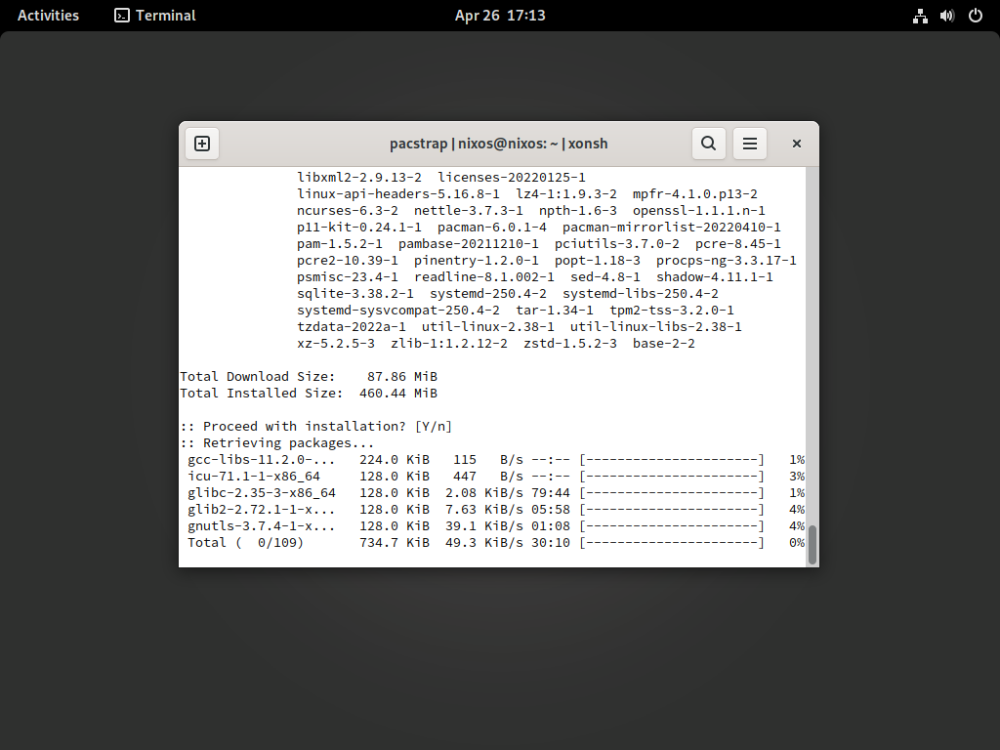

# Arch Linux Installation Medium on NixOS



Great thanks [@NickCao](https://github.com/NickCao) and other members of [NixOS Chinese Telegram Group](https://t.me/nixos_zhcn) for their help on this project!

## Build instructions

1. Clone this repository.

```sh
git clone https://github.com/SamLukeYes/my-livecd.git
cd my-livecd/
```

2. Have a look at `mirror.nix`, `reverse-proxy.nix` and `makeiso.sh`. Modify them according to their comments.

*NOTE: It's recommended to build this iso on `nixos-21.11` channel, because `gnupg-2.3` breaks `archlinux-keyring` currently.*

3. Run `makeiso.sh`.

```sh
chmod +x makeiso.sh
./makeiso.sh
```

4. Get the iso file in `result/iso` directory.